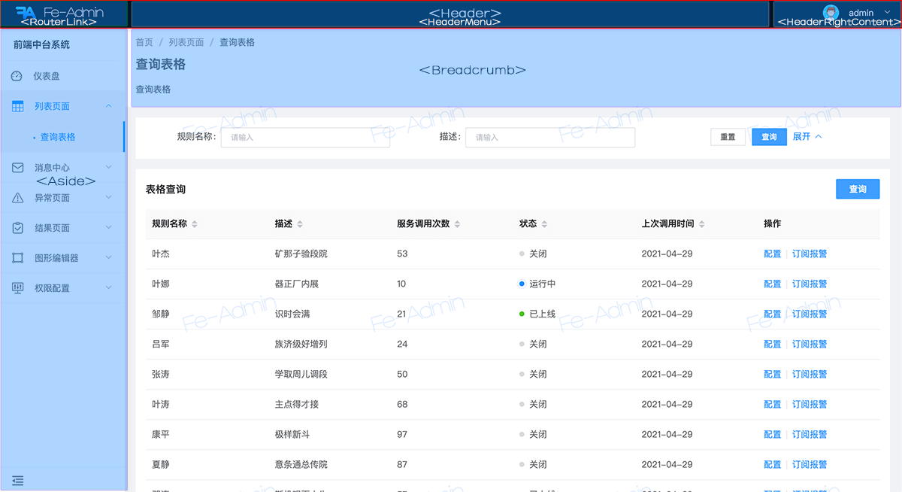

# 布局

页面整体布局是一个产品最外层的框架结构，往往会包含导航、侧边栏、面包屑以及内容等。想要了解一个前端项目，先要了解它的基础布局。

## Layout

::: tip 对应代码
[@/layout](https://github.com/fe-admin/fe-admin/tree/main/src/layout)
:::

fe-admin 中大部分页面都是基于这个 layout 的，除了个别页面如：login , 404。

## 移动端

element-ui 官方对自己的定位是桌面端后台框架，而且对于管理后台这种重交互的项目来说是不能通过简单的适配来满足桌面端和移动端两端不同的交互，所以真要做移动版后台，建议重新做一套系统。

所以本项目也不会适配移动端，只是用 media query 做了一点简单的响应式布局，有需求请自行修改。
